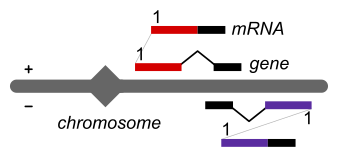

# 

From high-throughput sequencing **mapped reads** ([SAM/BAM](https://samtools.github.io/hts-specs/)), **GeneAbacus**:
* Creates **profiles** representing coverage depth per nucleotide,
* **Counts** reads mapped within user selected features such as chromosomes or genes.

## Features

* Input
    * mRNA-seq, Ribo-seq, ChIP-seq, CLIP-seq, Structure-seq, Massively Parallel Reporter Assays (MPRAs) etc
    * Any type of features, e.g. chromosomes, genes, mRNAs or constructs from MPRAs using the [FON](https://sr.ht/~vejnar/FONtools) or tab format.
    * *Unsorted* or sorted [SAM/BAM](https://samtools.github.io/hts-specs/) files. SAM files can be compressed (see `-sam_command_in`).
* Filter reads by overlap, length, mapping quality, using a set of user-defined features, or randomly
* Optionally use orientation (strand) of reads and features
* Output
    * **Counts**: RPKM or TPM in CSV files
    * **Profiles**
        * Genomic and transcriptomic profiles
        * Using first, last, or all positions (i.e. depth of coverage) in reads or pairs of reads
        * Optionally taking into account mRNA splicing
        * Multiple formats: [BedGraph](https://genome.ucsc.edu/goldenPath/help/bedgraph.html), [binary](#profile-binary-format) or CSV
* Fast. Implemented in Go using [biogo](https://github.com/biogo) and Go channel-based parallelization

## Why?

1. **Flexibility: Analyzing standard and novel high-throughput sequencing (HTS) experiments**. High-throughput sequencing has been adapted to measure a variety of biological traits in both DNA and RNA. Some methods have become standard such as mRNA-seq, some are becoming standard like Ribo-seq or CLIP-seq, and some require unique and specialized designs, as in MPRAs. **GeneAbacus provides *many* types of count and profile methods** adapted for many of these methods. Simultaneously, new profile methods can easily be added using the existing methods as templates.

2. **Mapping coordinates: DNA and RNA profiles**. HTS experiments are usually mapped to the genome. From the mapped reads, tools providing genome coverage are very useful to generate genomic profiles used for data visualizing in genome browsers. However, while downstream analyses for experiments based on genomic DNA, such as ChIP-seq, can directly use genome coverage of mapped reads, analysis of RNA-based experiments are less straightforward. Most RNAs are strand-specific and/or spliced. Using an algorithm to map coordinates from genomic DNA to RNA, **GeneAbacus generates strand-specific RNA profiles**. RNA profiles can then be directly used for downstream analysis.

    

3. **Flexibility: Output formats**. GeneAbacus can export to [BedGraph](https://genome.ucsc.edu/goldenPath/help/bedgraph.html) files and in text form (CSV). While BedGraph is widely used, making it appropriate for sharing data, it is not trivial to parse these files efficiently. To overcome this hurdle, **GeneAbacus exports to an *ad-hoc* binary format**. The [binary](#profile-binary-format) format is a simple memory dump, together with a checksum for integrity. This makes it fast and easy to load data for downstream analysis in Python or other environments.

4. **Speed**: High speed is achieved using Go, parallelization and favoring _unsorted_ over _sorted_ SAM/BAM. To profile and count, GeneAbacus goes through the mapped reads by processing the input SAM/BAM file(s) from beginning to end. This is true for unsorted and sorted SAM/BAMs. GeneAbacus tries to overlap each mapped read (or pair of reads) with a feature. To speed up the overlapping operations, the GeneAbacus core algorithm uses a [binary search tree](https://en.wikipedia.org/wiki/Binary_search_tree) built using the features represented as intervals of coordinates.

    Most tools (such as [BEDtools genomecov](https://bedtools.readthedocs.io/en/latest/content/tools/genomecov.html) or [mosdepth](https://github.com/brentp/mosdepth)) require _sorted_ BAM files. This imposes computationally expensive steps to convert SAM files into sorted BAM files using [samtools](http://www.htslib.org). **GeneAbacus avoids these expensive steps by sorting the features instead of the reads**. This strategy has two advantages:
    1. Unsorted SAM/BAM files, such as the output from [Bowtie2](https://github.com/BenLangmead/bowtie2) or [STAR](https://github.com/alexdobin/STAR), can be used directly without sorting the reads. Sorting reads consumes large amount of RAM.
    2. When pair-end sequencing coverage (number of reads per base) is very high, in MPRA experiments for example, searching for the mate of a read in a pair is computationally expensive due to the design of BAM indices: for each pair, looking for the mate of a read required a search through all the reads mapped at the position of the mate one-by-one. Going through mates for each read in a pair can become the most expensive task.

    *Currently*, GeneAbacus can use SAM or BAM files containing:
    1. Single-end *sorted* and *unsorted* reads or,
    2. Paired-end *unsorted* reads.

    We recommend using compressed SAM files: they save as much space as BAM files and are processed as fast as BAM files when used with GeneAbacus.

    GeneAbacus is parallelized using Go channels.

## Download

See [refs](https://git.sr.ht/~vejnar/GeneAbacus/refs) page for tarball and executable.

## Examples

### Read count per transcript (mRNA)

```bash
geneabacus -path_bam "input.bam" \
           -path_features "danrer_cdna_all_ensembl104.fon1.json" \
           -read_strand "-" \
           -count_multis "1,900"
```

Computes read counts and RPKMs for mRNA-seq to `counts.csv` from `input.bam`. In this example, the library was prepared using a [dUTP](https://pubmed.ncbi.nlm.nih.gov/21943893/) protocol that produces antisense first reads to RNAs (set using option `-read_strand`). Using option `-count_multis`, two counts are generated per gene: one with  reads mapping uniquely ("1") to the genome and one with reads mapping uniquely *and* those mapping to up to 900 loci (each counting 1/n).

### Read count and profile per transcript for Ribo-seq

```bash
geneabacus -path_sam "input.sam.zst" \
           -sam_command_in "zstdcat" \
           -path_features "danrer_cdna_protein_coding_rpf_cds_exons_ensembl104.fon1.json" \
           -read_length "28,29" \
           -read_strand "+" \
           -profile_type "first" \
           -profile_multi "900" \
           -profile_norm
```

The input SAM is compressed using [Zstandard](https://github.com/facebook/zstd). Ribosome-protected fragments (sense to mRNA) of length 28 and 29 nucleotides, mapping a maximum of 900 times in the genome (each counting 1/n) are added to mRNA profiles using the first position of each read. Profiles are normalized to RPM. By default, profiles are output to `profiles.bedgraph` in [BedGraph](https://genome.ucsc.edu/goldenPath/help/bedgraph.html) format. For a more convenient format, see our *binary* format below which is easy to import into Python for downstream analysis.

### Genomic profile per chromosome for ChIP-seq

```bash
geneabacus -path_bam "input.bam" \
           -path_features "danrer_genome_all_ensembl_grcz11_chrom_length.tab" \
           -format_features "tab" \
           -profile_type "all" \
           -profile_norm \
           -profile_multi 1 \
           -profile_no_coord_mapping
```

Genomic profiles are directly viewable as genome browser tracks (default output format is [BedGraph](https://genome.ucsc.edu/goldenPath/help/bedgraph.html)). The `all` profile type generates genomic "coverage". In this case, the profiles are generated for each chromosome (in the `tab` file). Since chromosomes are the same features used for mapping the reads, there is no need to map coordinates from mapped genomic features to genomic profiles: use `-profile_no_coord_mapping` to skip this step.

## Input

* Mapped reads
    * `-path_bam` Path to BAM file(s). Multiple files can be specified using a comma separated list.
    * `-path_sam` Path to SAM file(s). Multiple files can be specified using a comma separated list.
        * `-sam_command_in` Command line to execute for opening each SAM file (comma separated). For example `-sam_command_in zstdcat` to open a Zstandard-zipped file (`*.sam.szt`).
    * `-paired` for pair-end sequencing. SAM/BAM with paired reads **must** be unsorted, so that the reads of each pair are next to each other.

* Filtering mapped reads
    * By length
        * `-fragment_min_length` Minimum fragment length
        * `-fragment_max_length` Maximum fragment length
        * `-read_length` Comma separated list of specific read length(s)
    * By mapping quality
        * `-read_min_mapping_quality` Minimum read mapping quality (5th column in SAM, MAPQ)
        * `-read_in_proper_pair` Only read in proper pairs (default: all pairs) (2nd column in SAM, 0x2 flag)
    * Proportion
        * `-rand_proportion` Randomly select a proportion of all reads (from 0. to 1.). `0.5` will keep 50% of the reads/pairs.
    * Overlap with features
        * `-read_min_overlap` Minimum total overlap of the read with the feature interval(s) (default 10) to be counted and included into the profile.

* Library
    * `-read_strand` Specify strandness of the sequenced library by setting the orientation of read 1, i.e. + or - or unstranded if empty.

* Features
    * `-path_features` Path to features file
    * `-format_features FON` (default) [FON](https://sr.ht/~vejnar/FONtools) format
        Within FON, specify where to find the name of the features, their chromosome, coordinate list (such as exons), and strand:
        * `-fon_name` FON key for feature name (default "transcript_stable_id")
        * `-fon_chrom` FON key for chromosome or locus (default "chrom")
        * `-fon_coords`FON key for coordinates (exons for example) (default "exons")
        * `-fon_strand` FON key for strand (default "strand")
    * `-format_features tab` Tabulated file
        * `-feature_strand` Default feature strand (default "+")
    * `-path_mapping` Path to feature name(s) mapping (tabulated file). For example, if features are chromosomes, this file can be used to translate chromosome/contig names from Ensembl to UCSC names.

* Filtering features. Filter input reads. Only reads mapping to features within the filter will be further processed. All options have the same name of the main features with the added suffix `_filter`. For example, filter features can be used to filter out reads from a Ribo-seq experiment that are not mapped to exons. Remaining reads can then be counted within coding-sequences (CDS) using `-format_features`.
    * `-path_features_filter` Path to filtering features file
    * `-format_features_filter FON` (default) [FON](https://sr.ht/~vejnar/FONtools) format
        Within FON, specify where to find the name of the features, their chromosome, coordinate list (such as exons), and strand:
        * `-fon_name_filter` FON key for feature name (default "transcript_stable_id")
        * `-fon_chrom_filter` FON key for chromosome or locus (default "chrom")
        * `-fon_coords_filter`FON key for coordinates (exons for example) (default "exons")
        * `-fon_strand_filter` FON key for strand (default "strand")
    * `-format_features_filter tab` Tabulated file
        * `-feature_strand_filter` Default feature strand (default "+")
    * `-include_missing_in_filter` Common use cases of filter require each feature to be in the main (specified with `-path_features`) and the filter (specified with `-path_features_filter`) features. By default, GeneAbacus will check that each feature from the main can also be found in the filter using the feature name. `-include_missing_in_filter` removes this check allowing for features to be absent in the filter.

## Output

* `-ignore_nh_tag` Software mapping reads, notably RNA such as [STAR](https://github.com/alexdobin/STAR), add an NH tag in the optional fields of SAM files. The NH tag holds the total number of hits. With this option, any NH tag will be ignored and all alignments will be considered unique (i.e. NH=1).
* `-path_report` Write a report to this path (stdout with `-`)
* `-path_sam_out` Path to saved SAM file containing read(s) included in counts or profiles
* `-append` Instead of creating new count and/or profile files and eventually overwriting existing files, this option will open existing files using APPEND mode, and append content at the end of existing files.

### Count

* Multiplicity
    * `-count_multis` Multiple counts can be generated including reads/pairs mapping uniquely ("1") to the genome or not. A read multiplicity of "2" will include reads/pairs mapping uniquely *and* those mapping to two loci. Multiple counts are specified using a comma separated list (default "1,2,900").
* Total
    * `-count_totals` Totals used for normalization such as computing RPKM are calculated by the program. If desired, totals can be specified by the user as comma separated list of totals. This list must have the same number of totals as multiplicity in the `-count_multis` list.
    * `-count_total_real_read` Totals used for normalization such as computing RPKM are calculated as the number of alignments intersecting with the features. Each alignment is weighted by their multiplicity (number of hits for the read from the NH tag) so that a read will count 1/NH for each alignment. While this approach is acceptable, this calculation is an approximation: the NH tag is computed genome-wide while most counts are not (on the transcriptome for example). The `-count_total_real_read` option calculates the real total number of reads by counting the reads intersecting the features using their name. Be aware, this option requires large amounts of RAM.
* `-count_path` Path to counts output (default `counts.csv`)
* `-count_in_profile` Only count reads included in the profiles

### Profile

* `-profile_paths` Path to profile output(s) (comma separated) (default `profiles.bedgraph`)
* `-profile_formats` Profile output format. Available formats are *bedgraph*, *binary*' or *csv* (default *bedgraph*). Multiple formats can be set as comma separated list. The number of formats and output paths (in `-profile_paths`) must be the same.
* `-profile_multi` Maximum alignment multiplicity to include a read in the profile (default 900). See `-count_multis` for details.
* `-profile_norm` By default, profiles contains the number of reads per nucleotide. With `-profile_norm`, profile counts are normalized using total reads to RPM.
* `-profile_no_coord_mapping` Skip coordinate mapping from input to feature to speed things up. This option requires input reads and features to be within the same coordinate system (for example reads mapped to a genome and features being chromosomes). It only produces profile in the same orientation as the input and convenient to generate genomic profiles.
* `-profile_overhang` Overhang length to add to each side of the profiles

#### Profile type

* `-profile_type` Profile type: *first*, *last*, *first-last*, *position*, *all*, *all-extension* or *all-slice*

    
* *first*
    * `-profile_no_untemplated` Include only reads w/o untemplated nucleotide in the profile
    * `-profile_untemplated` Remove maximum untemplated nucleotides
* *position*
    * `-profile_position_fraction` Fraction of position between start and end for position profile (default 0.5)
* *all-extension*
    * `-profile_extension_length` Extension length

## Other options

* `-num_worker` Number of worker(s) to run in parallel (default 1)
* `-verbose` Verbose (adapt how much verbose is the output using `-verbose_level`)
* `-version` Print version and quit

## Profile *binary* format

The profile *binary* format consists of a header followed by the profile of each feature concatenated together. Data is stored as a raw sequence of bytes (in little-endian order) in a file with the `.bin` extension.


In the current version (3), the header contains 3 fields:
1. A version number stored as *uint8* (or *byte*)
2. The total length of all profiles added together stored as *uint32*
3. A checksum for the profiles length computed with [Adler-32](https://en.wikipedia.org/wiki/Adler-32) stored as *uint32* (see below).

How to split the concatenated profiles into individual profiles is not included in the binary file. A list of the length of each profile from a FON1, BED, or TAB file is required. A checksum insures that the same list of lengths is used at the creation of the binary file and when reading it. The checksum is computed by concatenating the lengths of each profile (*uint32*) into a raw sequence of bytes, of which an [Adler-32](https://en.wikipedia.org/wiki/Adler-32) checksum is calculated.

For reducing storage requirements, binary files are compressed using LZ4. Since most genomic profiles usually have many zeros, LZ4 offers fast decompression speed and a high compression rate. Other or no algorithm can easily be employed. Using this compression, binary profiles are not indexed and are intended to be fully loaded into RAM to be used in downstream analysis.

### Reading profiles from Python

```python
import geneabacus.profileio
profiles = geneabacus.profileio.pfopen('profiles.bin.lz4', 'danrer_cdna_protein_coding_ensembl104.fon1.json')
```

To get a transcript profile:
```python
profiles['ENSDART00000000486']
# will return
array([0., 0., 21., ..., 0., 3., 0.], dtype=float32)
```

## License

*GeneAbacus* is distributed under the Mozilla Public License Version 2.0 (see /LICENSE).

Copyright © 2015-2023 Charles E. Vejnar
